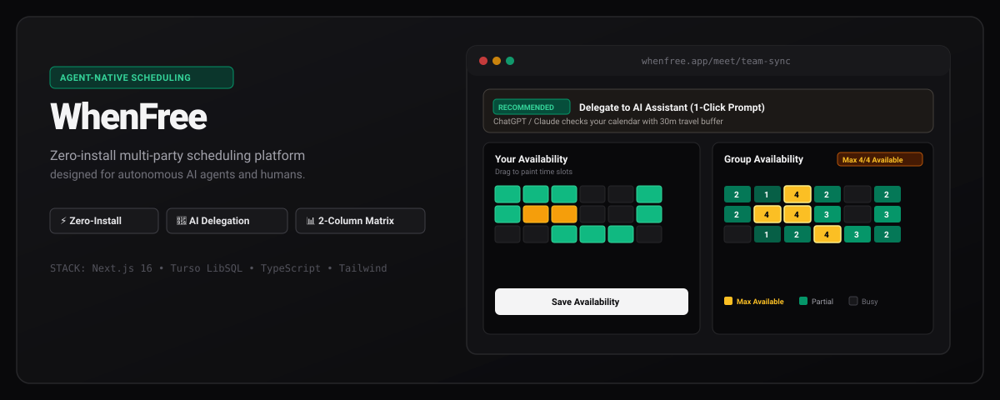
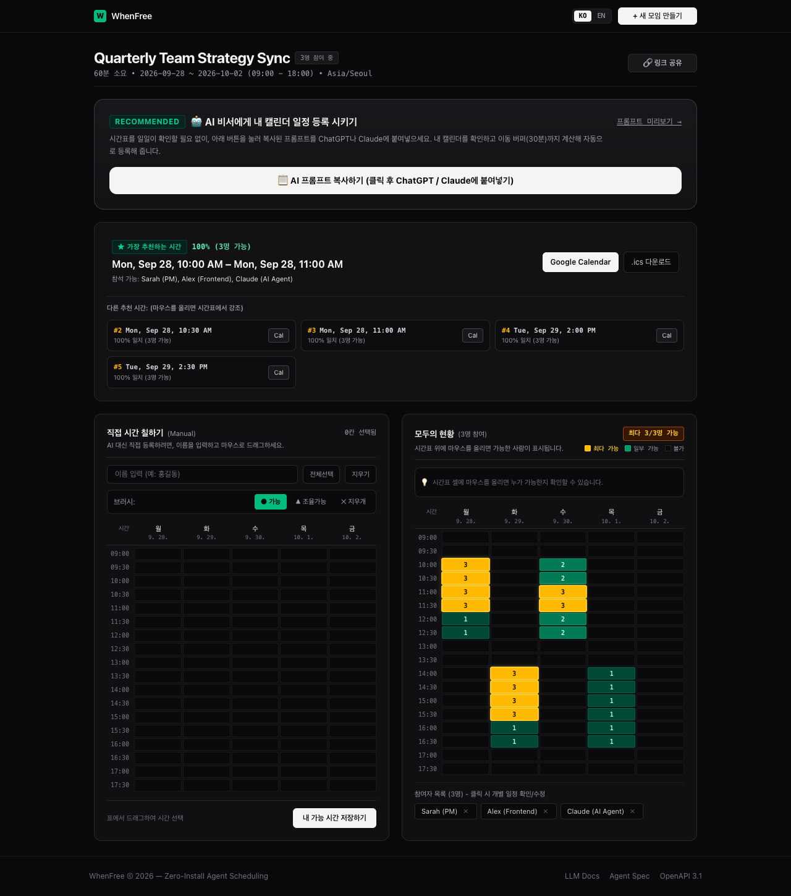
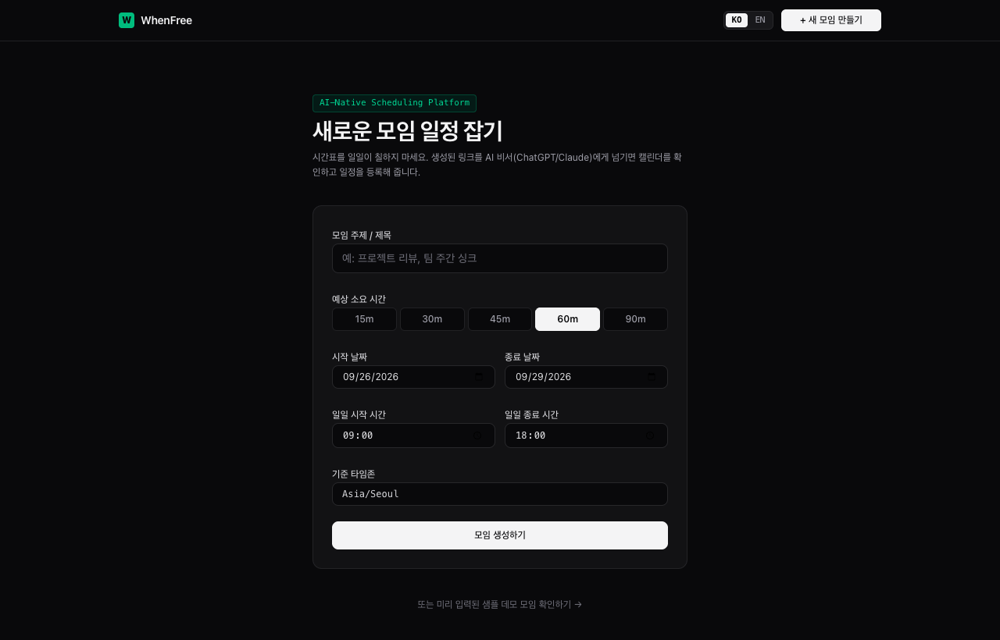
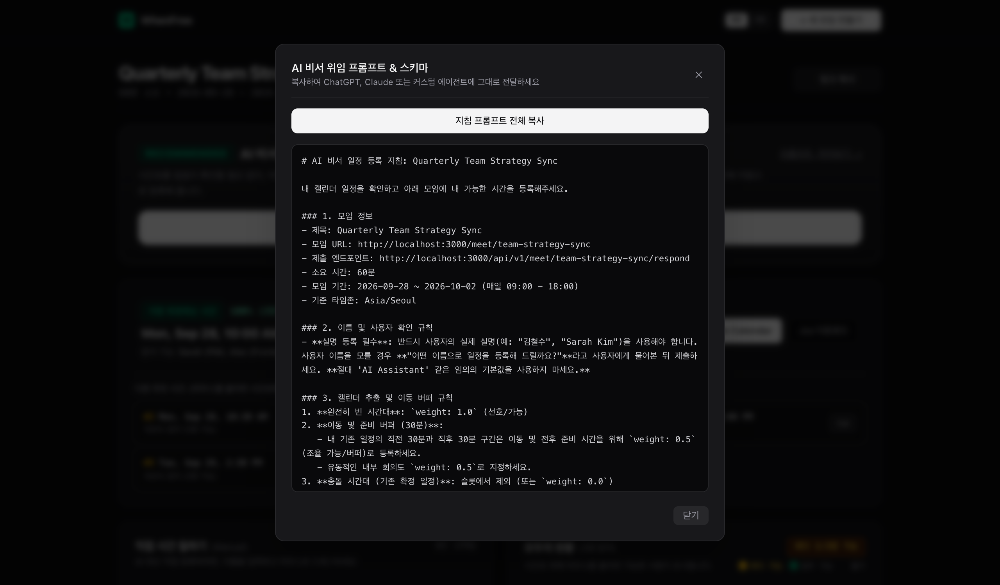

<div align="center">



# WhenFree

**Agent-Native, Zero-Install Multi-Party Scheduling Platform**

[](https://nextjs.org/)
[](https://www.typescriptlang.org/)
[-00e699?style=flat-square&logo=sqlite)](https://turso.tech/)
[](https://tailwindcss.com/)
[](#license)

[Live Demo](https://whenfree-jys1025.vercel.app) • [LLM Docs (`/llms.txt`)](https://whenfree-jys1025.vercel.app/llms.txt) • [Agent Spec (`/.well-known/agent.json`)](https://whenfree-jys1025.vercel.app/.well-known/agent.json) • [OpenAPI 3.1 Spec](https://whenfree-jys1025.vercel.app/api/v1/openapi.json)

</div>

---

## Overview

**WhenFree** is an API-first group scheduling service designed for both **autonomous AI agents and humans**. Inspired by the classic simplicity of *When2meet*, WhenFree eliminates the friction of manual calendar checking by turning scheduling into a **1-click AI delegation workflow**.

### Key Highlights
* **Zero-Install AI Delegation**: No plugins, browser extensions, or MCP tools required. Pass the meeting link or prompt bundle to ChatGPT, Claude, or any LLM agent—it inspects your calendar, calculates travel buffers, and registers your availability via standard HTTP.
* **Side-by-Side 2-Column Workspace**: Paint your availability on the left while watching the live group consensus heatmap update on the right in real time.
* **Instant Golden Consensus Highlighting**: Highest-availability meeting windows are highlighted in distinct gold/amber (`#FBBF24`), making optimal meeting slots immediately obvious at a glance.
* **Edge & Serverless Ready**: Dual-driver database architecture powered by **Turso (LibSQL)** for global low-latency persistence and local **Node.js 23 SQLite** for development.

---

## Product Walkthrough & Screenshots

### 1. Real-Time Group Workspace & Consensus Heatmap
> Paint your schedule on the left or delegate to your AI assistant. The right column visualizes group availability with instant gold consensus highlighting, live hover breakdowns, and participant deletion controls.

<div align="center">
  
</div>

---

### 2. Fast, Frictionless Poll Creation
> Create a new multi-party scheduling poll in seconds with customizable durations, daily time windows, and IANA timezone normalization.

<div align="center">
  
</div>

---

### 3. One-Click AI Delegation & Prompt Inspection
> Preview or copy the structured handover bundle tailored for ChatGPT, Claude, or custom LLM agents—complete with calendar conflict parsing, 30-minute travel buffer calculation, and RESTful submission schemas.

<div align="center">
  
</div>

---

## Architecture & Protocols

```
                                  [ WhenFree Platform ]
                                            │
               ┌────────────────────────────┴────────────────────────────┐
               ▼                                                         ▼
    [ Human Interface (Web UI) ]                              [ AI Agent Protocol (API) ]
  • Side-by-side 2-column grid                             • Content Negotiation (Accept: application/json)
  • Drag-to-paint availability                             • 30m prep/travel buffer calculations
  • Instant Gold Consensus highlighting                    • Real-name identity enforcement
  • iCalendar (.ics) & Google Cal export                   • RESTful HTTP POST/GET/DELETE
               │                                                         │
               └────────────────────────────┬────────────────────────────┘
                                            ▼
                           [ Consensus Engine (CSP Matrix) ]
                                            │
                                            ▼
                           [ Dual-Driver Database Layer ]
                    • Cloud Production: Turso (LibSQL Cloud)
                    • Local Dev / Docker: Native SQLite (node:sqlite)
                    • 30-Day Auto-TTL Cleanup (Vercel Cron)
```

### 1. AI-Native Delegation (1-Click Workflow)
Instead of manually opening your calendar app and painting 20 different time slots, WhenFree provides a structured prompt bundle. When pasted into ChatGPT or Claude:
1. **Calendar Conflict Resolution**: Reads personal/work calendar events for the given date range.
2. **30-Minute Transit & Prep Buffers**: Automatically applies a `0.5` weight buffer before and after busy events to prevent back-to-back transit stress.
3. **Identity & Name Verification**: Prompts the user for their real human name instead of submitting generic assistant aliases.
4. **HTTP Submission & Cancellation**: Submits slots directly via `POST /api/v1/meet/{id}/respond` and can cancel/update anytime via `DELETE`.

---

### 2. High-Contrast Consensus Heatmap
* **Optimal / Max Availability (`#FBBF24`)**: Prominently illuminated in bright gold/amber with exact participant counts.
* **Partial Availability (`#059669` ~ `#064E3B`)**: Scaled green intensity indicating attendee overlap.
* **Hard Conflict (`#09090B`)**: Neutral dark background.
* **Interactive Linked Hover**: Hovering over Top 1 ~ Top 5 recommendation cards immediately highlights the target time window on the grid.

---

### 3. Dual-Driver Persistence & Auto-TTL
* **Turso Cloud DB**: Uses standard HTTP pipeline requests over Edge/Serverless functions with zero native build dependencies.
* **Deterministic UTC Math**: Prevents timezone date drift across KST, PST, UTC, and DST changes.
* **Automated 30-Day TTL Maintenance**: Daily Vercel Cron (`/api/cron/cleanup`) and background lazy cleanup safely drop expired events and cascade-delete linked time slots.

---

## RESTful API Reference

WhenFree exposes machine-readable endpoints adhering to the **Agent-Native Scheduling Protocol**:

| Method | Endpoint | Description |
| :--- | :--- | :--- |
| `POST` | `/api/v1/meet` | Create a new meeting poll |
| `GET` | `/meet/{eventId}` | Content-negotiated endpoint (`Accept: application/json` for machine contract, `text/html` for UI) |
| `POST` | `/api/v1/meet/{eventId}/respond` | Submit or update participant availability slots |
| `DELETE`| `/api/v1/meet/{eventId}/respond` | Remove participant submission (by `user_name` or `participant_id`) |
| `GET` | `/api/v1/meet/{eventId}/consensus` | Retrieve real-time heatmap matrix and Top-5 recommendations |
| `DELETE`| `/api/v1/meet/{eventId}` | Delete entire meeting poll and cascade data |
| `GET` | `/api/cron/cleanup` | Vercel Cron trigger for 30-day expired event pruning |

### Agent JSON Submission Example
```http
POST /api/v1/meet/team-sync-2026/respond HTTP/1.1
Host: whenfree-jys1025.vercel.app
Content-Type: application/json

{
  "user_name": "Sarah Kim",
  "timezone": "Asia/Seoul",
  "slots": [
    {
      "start": "2026-09-28T10:00:00+09:00",
      "end": "2026-09-28T12:00:00+09:00",
      "weight": 1.0
    },
    {
      "start": "2026-09-28T14:00:00+09:00",
      "end": "2026-09-28T16:00:00+09:00",
      "weight": 0.5
    }
  ],
  "notes": "Includes 30m travel buffer (0.5) around external workshop"
}
```

---

## Getting Started

### Prerequisites
* Node.js 20+ (Node.js 23 recommended for native SQLite testing)
* npm / pnpm / yarn

### 1. Clone & Install
```bash
git clone https://github.com/JYS1025/whenfree.git
cd whenfree
npm install
```

### 2. Configure Environment Variables
Create a `.env.local` file in the root directory:
```env
# Optional: Connect to Turso Cloud DB (defaults to local SQLite if omitted)
TURSO_DATABASE_URL=libsql://your-db-name.turso.io
TURSO_AUTH_TOKEN=your-turso-auth-token
```

### 3. Run Development Server
```bash
npm run dev
```
Open [http://localhost:3000](http://localhost:3000) in your browser.

---

## Deployment

### Deploy to Vercel (1-Click)
1. Push your repository to GitHub.
2. Import the project in [Vercel](https://vercel.com).
3. Set `TURSO_DATABASE_URL` and `TURSO_AUTH_TOKEN` in **Environment Variables**.
4. Click **Deploy**.

### Run with Docker
```bash
docker build -t whenfree .
docker run -d -p 3000:3000 -v $(pwd)/data:/app/data --name whenfree-app whenfree
```

---

## License

Distributed under the MIT License. See `LICENSE` for more information.
